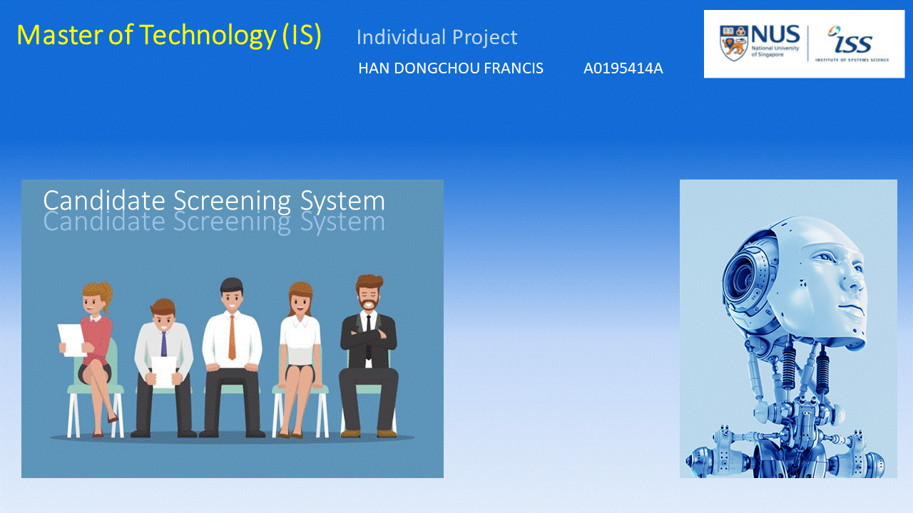

### CANDIDATE SCREENING SYSTEM

[Online editor for this README.md markdown file](https://pandao.github.io/editor.md/en.html "pandao")

---

### <<<<<<<<<<<<<<<<<<<< Start of Template >>>>>>>>>>>>>>>>>>>>

---

## SECTION 1 : PROJECT TITLE
## Candidate Screening System

---
## SECTION 2 : EXECUTIVE SUMMARY / PAPER ABSTRACT
In the world of recruitment, matching the right talent to the vacancy is always a challenge. When a vacancy is posted, there will usually be many applications and the challenge is the arduous task of sieving through the sea of profiles.
For this reason, I have come up with a simple application to help recruiters screen the profiles that are submitted for the available positions.
The purpose for this application is to cut down the time that the recruiters take to screen the profiles.
This application makes use of the KIE Workbench for the workflow, as well as the Decision Tree to execute the main logic.

---
## SECTION 3 : CREDITS / PROJECT CONTRIBUTION

Official Full Name	     Student ID (MTech Applicable)	

HAN DONGCHOU FRANCIS	A0195414A	

---
## SECTION 4 : USER GUIDE

`<Github File Link>` : <https://github.com/telescopeuser/Workshop-Project-Submission-Template/blob/master/UserGuide/User%20Guide%20HDB-BTO.pdf>

### [ 1 ] To run the system using iss-vm

> download pre-built virtual machine from http://bit.ly/iss-vm

> start iss-vm

> open terminal in iss-vm

> $ git clone https://github.com/telescopeuser/Workshop-Project-Submission-Template.git

> **Go to URL using web browser** http://0.0.0.0:5000 or http://127.0.0.1:5000

---
## SECTION 5 : PROJECT REPORT / PAPER

`<Github File Link>` : <https://github.com/francis-han/IRS-MR-2019-07-01-IS1PT-IND-HanDongchouFrancis-CandidateScreeningSystem/blob/master/ProjectReport/Project%20Report2.pdf>

**Recommended Sections for Project Report / Paper:**
- Executive Summary / Paper Abstract
- Sponsor Company Introduction (if applicable)
- Business Problem Background
- Project Objectives & Success Measurements
- Project Solution (To detail domain modelling & system design.)
- Project Implementation (To detail system development & testing approach.)
- Project Performance & Validation (To prove project objectives are met.)
- Project Conclusions: Findings & Recommendation
- List of Abbreviations (if applicable)
- References (if applicable)

---

### <<<<<<<<<<<<<<<<<<<< End of Template >>>>>>>>>>>>>>>>>>>>

---

**This [Machine Reasoning (MR)](https://www.iss.nus.edu.sg/executive-education/course/detail/machine-reasoning "Machine Reasoning") course is part of the Analytics and Intelligent Systems and Graduate Certificate in [Intelligent Reasoning Systems (IRS)](https://www.iss.nus.edu.sg/stackable-certificate-programmes/intelligent-systems "Intelligent Reasoning Systems") series offered by [NUS-ISS](https://www.iss.nus.edu.sg "Institute of Systems Science, National University of Singapore").**

**Lecturer: [GU Zhan (Sam)](https://www.iss.nus.edu.sg/about-us/staff/detail/201/GU%20Zhan "GU Zhan (Sam)")**

**zhan.gu@nus.edu.sg**
